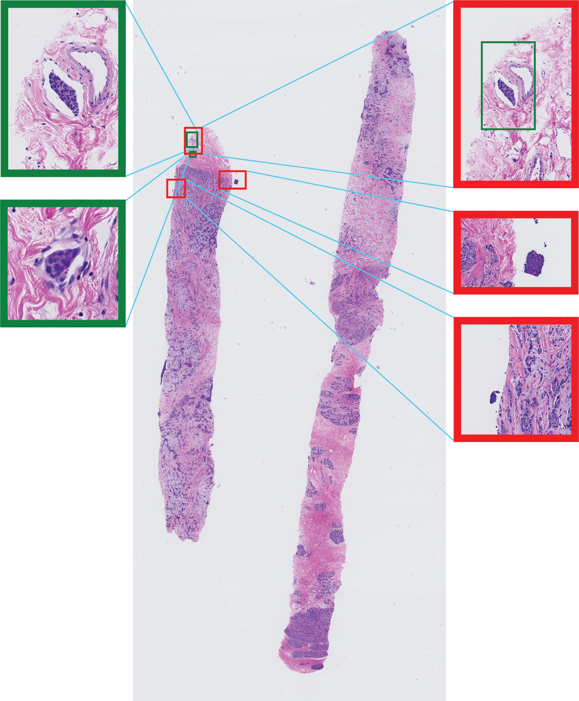

# Lymphovascular Invasion Detection in Breast Cancer Using Deep Learning

This repository contains code and models for detecting Lymphovascular Invasion (LVI) in breast cancer tissues using deep learning techniques. The approach is based on Multiple Instance Learning (MIL) and leverages histological data for the automated classification of cancerous tissues.

## Table of Contents

- [Overview](#overview)
- [Framework](#framework)
- [Results](#results)
- [Acknowledgments](#acknowledgments)

## Overview

Lymphovascular invasion (LVI) is a crucial feature in breast cancer, linked to a higher risk of metastasis and poorer prognosis. Manual detection is labor-intensive and prone to variability. This project uses deep learning models, specifically Swin-Transformer and GigaPath, to automate LVI detection in whole-slide images of breast cancer tissue. Trained on 90 annotated H&E-stained breast cancer slides, the models achieved an AUC of 97%, a sensitivity of 79%, and an average of 8 false positives per slide, demonstrating the potential of these models to improve diagnostic accuracy and consistency.

## Framework

  
   
  <em>Figure 1: Overview of the Proposed Framework. (a) Training Phase: (I) LVI foci are annotated by two pathologists, with a third resolving disagreements. (II) Swin-Small uses extracted patches for fine-tuning. (III) GigaPath tessellates the WSI and extracts patch embeddings for binary classification. (b) Inference Phase: (1) Swin-Small predicts patch-wise probabilities using tessellation and sliding window, with postprocessing to identify LVI. (2) GigaPath computes patch probabilities in one step, followed by postprocessing to locate LVI.</em>

## Results

  

    
  

  

    
  

   
  <em>Figure 2: Left: A WSI with predictions from Swin-Small. Right: The same WSI with predictions from GigaPath. The predicted LVI locations are highlighted with red boxes, while the ground-truth LVI locations are marked with green boxes.</em>

